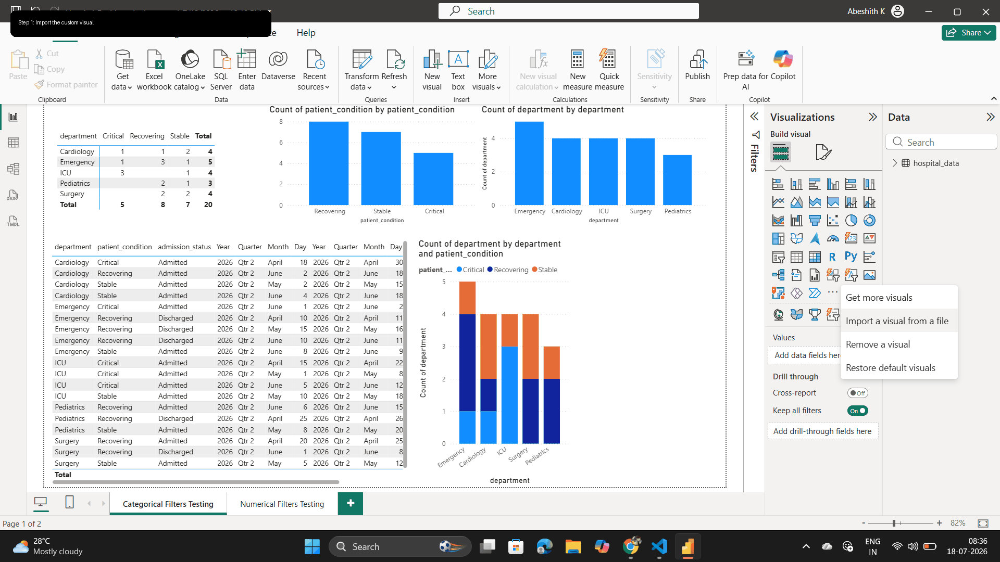

     

---

## Power BI Bot - Intelligent Natural Language Queries Meet Dynamic Dashboard Intelligence

> Data finds patterns. Intelligence finds meaning.

An intelligent Power BI custom visual that leverages AI to interpret natural language queries and provide dynamic filtering and real-time insights across your dashboard.

## Key Capabilities

- Natural Language Intelligence - Ask questions in plain English
- Intelligent Data Filtering - AI interprets intent and applies precise filters
- Real-Time Dashboard Updates - Connected visuals respond instantly
- Semantic Context Understanding - Understands your business domain
- Multi-Field Exploration - Configure multiple data dimensions
- Cross-Visual Synchronization - Filters propagate seamlessly

---

## Getting Started

### System Requirements

- Node.js 14+ and npm
- Python 3.8 or higher
- Power BI Desktop

### Initial Setup

#### 1. Launch the Backend Service

1. Navigate to the backend directory
2. Run the main application to start the backend service on port 8000
3. The service will listen for incoming queries

#### 2. Build and Package the Custom Visual

1. Navigate to the custom visual project directory
2. Install dependencies and build the visual
3. Package the visual for import
4. The packaged visual file will be ready for import

---

## Demo

---

## How to Use

### Step 1: Prepare the Custom Visual Package

1. Navigate to the custom-visual directory
2. Run npm build to compile the visual
3. Run npm package to create the visual package file
4. The packaged visual file is now ready for import

### Step 2: Import the Custom Visual

1. Open your Power BI report
2. In the visualizations pane, select import a custom visual from a file
3. Browse to and select your packaged visual file

### Step 3: Add the Visual to Your Dashboard

1. Click the imported Power BI Bot visual to add it to your canvas
2. Drag and drop it inside your dashboard
3. Resize and position it as needed

### Step 4: Configure Your Data Fields

1. With the visual selected, drag relevant data fields into the Values area
2. Add all fields you want to make searchable and filterable
3. Configure fields exactly as you would for other Power BI visuals

### Step 5: Ensure Backend is Running

1. Make sure the backend service is running on port 8000
2. The service must be active for queries to process

### Step 6: Query Your Data

1. Locate the search box within the Power BI Bot visual
2. Type your question in natural language (e.g., "Show critical patients in ICU")
3. Press Enter to submit your query

### Step 7: View Results

1. The filters are automatically applied to your data
2. Connected visuals on the dashboard update in real-time
3. The visual displays the filtered results based on your query

---

## How It Works

The system consists of three main components:

**Backend Service** - Python-powered service that interprets natural language queries and generates appropriate filters.

**Visual Interface** - TypeScript-based Power BI custom visual that provides the search interface and communicates with the backend.

**Dashboard Integration** - Integrates with Power BI's native filtering mechanism to influence all connected visuals.

---

## Quick Reference

1. Start backend service from the backend directory
2. Run build and package commands in custom-visual directory
3. Import packaged visual into Power BI
4. Add to dashboard and configure data fields
5. Query using natural language in the search box

